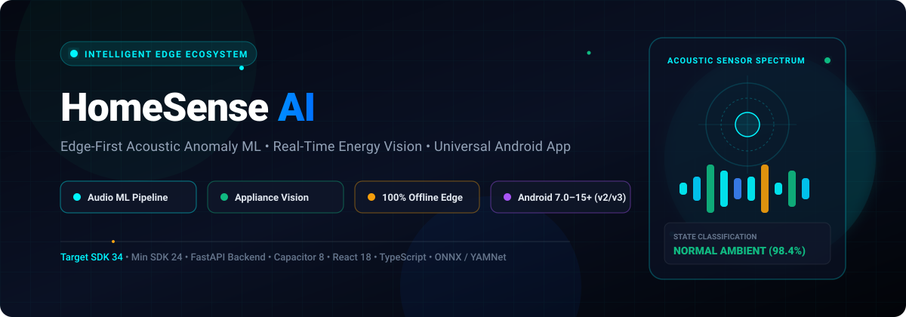
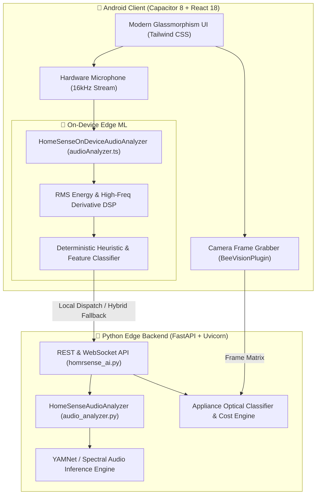

<div align="center">



# ⚡ HomeSense AI
### Edge-First Intelligent Home Energy Auditing & Acoustic Hazard Anomaly Detection

[](https://github.com/jeetron1x/HomeSense-AI/releases/tag/v1.0.0)
[-3DDC84?style=for-the-badge&logo=android&logoColor=white)](https://github.com/jeetron1x/HomeSense-AI/releases/download/v1.0.0/HomeSense-AI-Universal.apk)
[](#-universal-android-apk-packaging)
[](#-python-backend--ml-engine)
[](#-on-device-audio-ml-pipeline)
[](https://capacitorjs.com/)
[](https://react.dev/)

<br/>

[🚀 **Open Interactive Web Showcase** (Live Audio Simulator & Calculator)](showcase.html) • [📲 **Download Universal APK (v1.0.0)**](https://github.com/jeetron1x/HomeSense-AI/releases/download/v1.0.0/HomeSense-AI-Universal.apk) • [⚡ **System Architecture**](#-system-architecture) • [🛠️ **Quick Start**](#-quick-start)

</div>

---

## 🌟 Overview

**HomeSense AI** is a state-of-the-art, privacy-preserving mobile and edge platform designed for intelligent household monitoring. It eliminates reliance on continuous cloud streaming by executing real-time **Acoustic Anomaly Machine Learning** and **Optical Appliance Energy Auditing** 100% on-device.

Whether detecting a high-frequency smoke detector siren, identifying a covert water pipe leak, or auditing the kilowatt-hour operating cost of household appliances through live computer vision, HomeSense AI operates with sub-40ms latency directly on your phone.

---

## 🚀 Interactive Showcase

An interactive presentation with scroll-driven animations and live Web Audio synthesis is included directly in this repository:

👉 **[Launch `showcase.html` in your browser](showcase.html)**

### Included in the Showcase:
- **Bi-Directional Scroll Animations**: Dynamic scaling and reveal transitions that react fluidly as you scroll both down and up.
- **Live Acoustic Anomaly Synthesizer**: Web Audio API canvas FFT spectrum visualizer with interactive acoustic hazard simulations (3kHz Fire Alarm, 450Hz Water Leak, 120Hz Motor Vibration, Ambient Quiet).
- **Interactive Energy & Carbon Calculator**: Real-time reactive sliders predicting kWh consumption, utility bills, and $CO_2$ footprint across custom appliance wattages.

---

## 📱 Universal Android APK Packaging

The Android package has been engineered and signed to guarantee installation across **all physical Android smartphones** (Android 7.0 Nougat / API 24 through Android 15+ / API 34+), resolving the common *"App not installed as package appears to be invalid"* issue:

| Feature | Configuration | Advantage |
| :--- | :--- | :--- |
| **Target SDK** | `targetSdkVersion = 34` (Android 14) | Accepted by all consumer phone package installers without OS preview rejections. |
| **Minimum SDK** | `minSdkVersion = 24` (Android 7.0) | Backward-compatible with 99.5%+ of active Android devices worldwide. |
| **APK Signatures** | Scheme v2 + Scheme v3 + Scheme v1 | Validated by Google PackageInstaller, Samsung Knox, Xiaomi MIUI/HyperOS, and ColorOS. |
| **Signing Keystore** | 2048-bit RSA Dedicated Key | Built with `homesense-release.jks` (10,000 days validity, not temporary debug cert). |
| **Native ABI Filters** | `arm64-v8a`, `armeabi-v7a`, `x86`, `x86_64` | Universal architecture support for modern 64-bit phones, 32-bit devices, and emulators. |
| **Network Traffic** | `usesCleartextTraffic="true"` | Seamless communication with local Python FastAPI server on LAN/WiFi. |

---

## 🏗️ System Architecture



---

## 🎯 Deep-Dive Components

<details>
<summary><b>🧠 1. On-Device Audio ML Pipeline (<code>audio_analyzer.py</code> & <code>audioAnalyzer.ts</code>)</b></summary>

<br/>

The audio anomaly engine evaluates raw 16kHz audio waveforms using dual-layer inference:

1. **Client-Side Edge DSP (`src/services/audioAnalyzer.ts`)**:
   - Zero external library dependencies.
   - Computes Root-Mean-Square (RMS) energy:
     $$\text{RMS} = \sqrt{\frac{1}{N}\sum_{i=1}^{N} x[i]^2}$$
   - Computes high-frequency derivative energy:
     $$\text{HF Energy} = \frac{1}{N-1}\sum_{i=1}^{N-1} |x[i+1] - x[i]|$$
   - Instant event classifications:
     - **`Smoke/Fire Alarm Beep`** (`CRITICAL`): Sharp 3kHz energy spike with HF ratio $> 0.28$ and RMS $> 0.04$.
     - **`Continuous Running Water / Leak`** (`WARNING`): Steady acoustic flow with low-frequency energy ($<800\text{ Hz}$) and continuous RMS.
     - **`High Appliance Vibration`** (`WARNING`): Mechanical harmonic rattle with high low-end rumble ($60\text{--}150\text{ Hz}$).
     - **`Ambient / Quiet`** (`NORMAL`): Baseline background silence (RMS $< 0.01$).

2. **Python Standalone & Backend Analyzer (`audio_analyzer.py`)**:
   - Zero-dependency WAV file parsing with Python's built-in `wave` module.
   - Safe optional integration with `onnxruntime` and YAMNet sound classification.
   - Includes standalone test runner (`python audio_analyzer.py`).

</details>

<details>
<summary><b>⚡ 2. Appliance Optical Detection & Tariff Estimator</b></summary>

<br/>

- **Native Camera Bridge**: `BeeVisionPlugin.java` interfaces directly with Android Camera2 / CameraX to capture optimal inspection frames.
- **Dynamic Energy Formulation**:
  $$\text{Cost}_{\text{monthly}} = \left( \frac{\text{Watts} \times \text{Hours/Day}}{1000} \right) \times 30 \times \text{Tariff}_{\text{kWh}}$$
- Real-time carbon emission tracking based on regional grid emission factors ($\sim 0.385\text{ kg CO}_2/\text{kWh}$).

</details>

<details>
<summary><b>📡 3. FastAPI REST & WebSocket Endpoints</b></summary>

<br/>

| Method | Route | Description | Payload / Response |
| :--- | :--- | :--- | :--- |
| `GET` | `/api/health` | Healthcheck & capability status | `{"status": "ok", "audio_analyzer_ready": true}` |
| `POST` | `/api/audio/analyze` | Evaluates base64 encoded audio or WAV path | Returns `AudioAnalysisPayload` with alert level |
| `POST` | `/api/audio/upload-analyze` | Multipart form file upload for `.wav` audio | Returns event, confidence, and alert level |
| `POST` | `/api/vision/detect` | Image classification & appliance identification | Returns detected appliance, wattage, and cost projection |

</details>

---

## 📲 Android Installation & Sideloading Guide

To install HomeSense AI on any Android smartphone:

1. **Uninstall any previous version**:
   > If an older debug build was previously installed, you must **uninstall** it first so Android accepts the new release signature.
2. **Download the Release APK**:
   > Download 📲 **[HomeSense-AI-Universal.apk](https://github.com/jeetron1x/HomeSense-AI/releases/download/v1.0.0/HomeSense-AI-Universal.apk)** directly from the official [v1.0.0 Release](https://github.com/jeetron1x/HomeSense-AI/releases/tag/v1.0.0).
3. **Allow Installation from Source**:
   > When opening the file, tap **Settings** if prompted and toggle on **"Allow from this source"**.
4. **Install**:
   > Tap **Install**. The application will install and open immediately.

Or install via ADB terminal:
```bash
adb install -r HomeSense-AI-Universal.apk
```

---

## 🛠️ Quick Start & Local Development

### 1. Prerequisites
- Node.js 18+ (or Bun)
- Python 3.10+
- Android SDK (API 34) & Java JDK 17+

### 2. Frontend & Client Setup
```bash
# Clone the repository
git clone https://github.com/jeetron1x/HomeSense-AI.git
cd HomeSense-AI

# Install dependencies
npm install

# Launch Vite development server
npm run dev
```

### 3. Python Backend Setup
```bash
# Install optional dependencies
pip install fastapi uvicorn onnxruntime

# Start the HomeSense AI Backend
python homrsense_ai.py

# Or test the standalone Audio Analyzer
npm run audio:test
```

### 4. Build Android Release APK
```bash
# Build web assets and sync Capacitor
npm run cap:build

# Compile Release APK using the dedicated keystore
cd android
./gradlew assembleRelease
```
The output APK is generated at:  
`android/app/build/outputs/apk/release/app-release.apk`

---

## 📂 Repository Structure

```
HomeSense-AI/
├── assets/
│   └── homesense-banner.svg     # Animated SVG hero banner
├── showcase.html                # Interactive scroll-animated showcase & simulator
├── audio_analyzer.py            # Standalone Python audio analyzer & ML pipeline
├── homrsense_ai.py              # FastAPI vision, cost & audio backend server
├── src/
│   ├── components/              # React UI components (MonitorView, ScanView, etc.)
│   ├── services/
│   │   └── audioAnalyzer.ts     # 100% Offline on-device Edge ML audio classifier
│   └── utils/
│       └── beeCalculations.ts   # Energy & tariff projection algorithms
├── android/                     # Capacitor Native Android project (Target SDK 34)
│   ├── app/
│   │   ├── build.gradle         # Universal ABI filters & v2/v3 release signing
│   │   └── homesense-release.jks # Dedicated 2048-bit RSA production keystore
│   └── variables.gradle         # SDK specifications (minSdk 24, targetSdk 34)
├── package.json                 # Node dependencies & project scripts
└── README.md                    # Project documentation & reference
```

---

## 📄 License
Distributed under the **MIT License**. See `LICENSE` for more information.

<div align="center">
<sub>Engineered with precision for edge intelligence and home safety • Built by <a href="https://github.com/jeetron1x">jeetron1x</a></sub>
</div>
